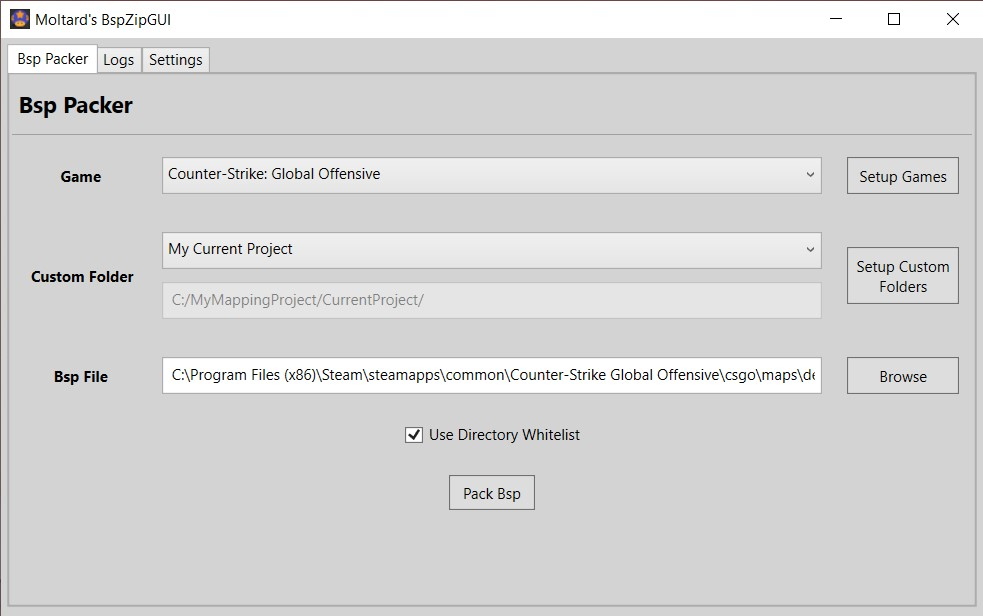

# BspZipGUI
A clean GUI tool that use Valve's BSPZIP command line utility. It is used to embed a folder with custom files (materials, models, sound,..) into a BSP file.

It can be used for any Source Engine game that provide a bspzip.exe.

This tool idea is based on [Geotavros's BspZipGui](https://github.com/geotavros/BspZipGui) .

## Downloads

[BspZipGUI v1.0](https://github.com/Moltard/BspZipGUI/releases/latest)

## How to use

Select a game you defined (3 are setup per default), a custom folder you defined and load a BSP.

Check 'Use Directory Whitelist' (recommended) to only pack files from whitelisted directories (see Settings).

Press Pack Bsp.

## How to setup

Add new games with the 'Add...' button. Delete them with the 'Delete' button.

Setup your games by loading the gameinfo.txt and bspzip.exe.

Add new custom folders with the 'Add...' button. Delete them with the 'Delete' button.

Load the folder with the custom files that you want to embed in your map.

Define a whitelist of subfolders and type of files (through their extensions) that can be packed. 

(All the subfolders you would need are already setup, but you can edit to your needs)

### Developers

- [Moltard](https://github.com/Moltard)

