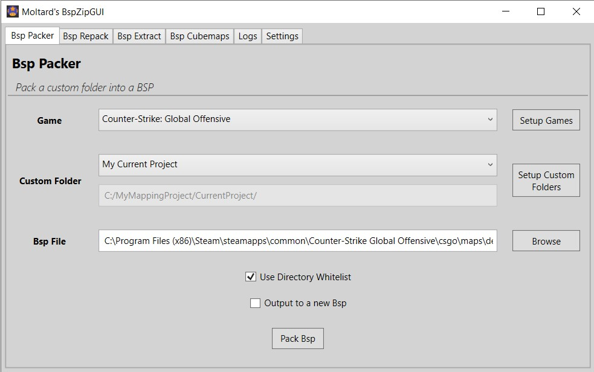

# BspZipGUI
A clean GUI tool that use Valve's BSPZIP command line utility. It is used to embed a folder with custom files (materials, models, sound,..) into a BSP file.

You can also repack a map to compress (or decompress it).

It can be used for any Source Engine game that provide a bspzip.exe.

This tool idea is based on [Geotavros's BspZipGui](https://github.com/geotavros/BspZipGui) .

## Download

[BspZipGUI v2.0](https://github.com/Moltard/BspZipGUI/releases/latest)

## How to use - Bsp Packer

Select a game you defined (3 are setup per default), a custom folder you defined and load a BSP.

Check 'Use Directory Whitelist' (recommended) to only pack files from whitelisted directories (see Settings).

Press Pack Bsp.

## How to use - Bsp Repack

Select a game you defined (3 are setup per default) and load a BSP.

Press Compress Bsp or Decompress Bsp.

## How to use - Bsp Extract

Select a game you defined (3 are setup per default) and load a BSP.

Either select a directory (drag drop possible) and click Extract to Directory, or click Extract to Zip.

All packed files will be extracted to the directory/zip file.

## How to use - Bsp Cubemaps

Select a game you defined (3 are setup per default) and load a BSP.

Either select a directory (drag drop possible) and click Extract cubemaps, or click Delete cubemaps.

<u>/!\</u> Deleting cubemaps actually delete every VTF files packed. That is how bspzip work.

## How to setup

Add new games with the 'Add...' button. Delete them with the 'Delete' button.

Setup your games by loading the gameinfo.txt and bspzip.exe.

Add new custom folders with the 'Add...' button. Delete them with the 'Delete' button.

Load the folder with the custom files that you want to embed in your map.

Define a whitelist of subfolders and type of files (through their extensions) that can be packed. 

(All the subfolders you would need are already setup, but you can edit to your needs)

### Extra setting

To not bloat the UI, one setting can only be changed by modifying **settings.xml**, which is the Asynchronous / Synchronous log output. When bspzip.exe is getting executed, you can either get the output of the process as it is getting executed (Async) or get all of it at once after it has finished (Sync).

It doesn't really affect the execution, but you can change it if you want by editing the following line:

  <IsSyncLogs>False</IsSyncLogs>

- **False** means that logs are Asynchronously displayed, which is the default behavior
- **True** means that logs are Synchronously displayed
- Not having the line (if you had old settings), will use Asynchronous mode and next time settings are saved, the value will be at **False**.

### Developers

- [Moltard](https://github.com/Moltard)

