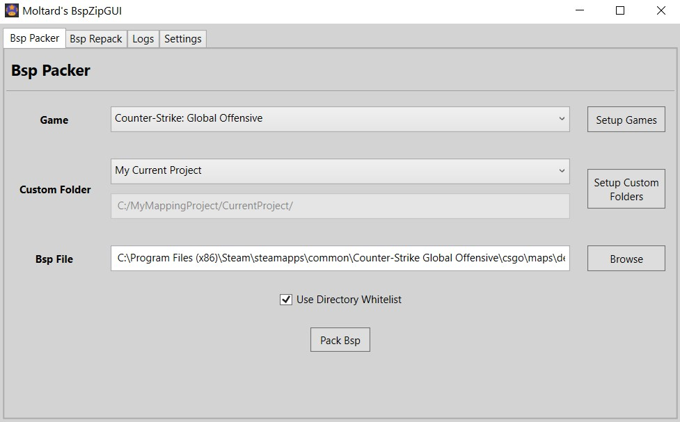

# BspZipGUI
A clean tool to pack BSP files using Valve's bspzip.exe.

## Downloads

[BspZipGUI v1.0](https://github.com/Moltard/BspZipGUI/releases/latest)

## How to use

Select a game, a custom folder you defined and load a bsp file.
Check 'Use Directory Whitelist' (recommended) to only pack files from whitelisted directories (see Settings).

Press Pack Bsp.

## How to setup

Setup your games by loading the gameinfo.txt and bspzip.exe.

Add custom folders with all the content that should be packed in the map.

Define a whitelist of subfolders and type of files (through their extensions) that can be packed. 

(All the subfolders you would need are already setup, but you can edit to your needs)

### Developers

- [Moltard](https://github.com/Moltard)

