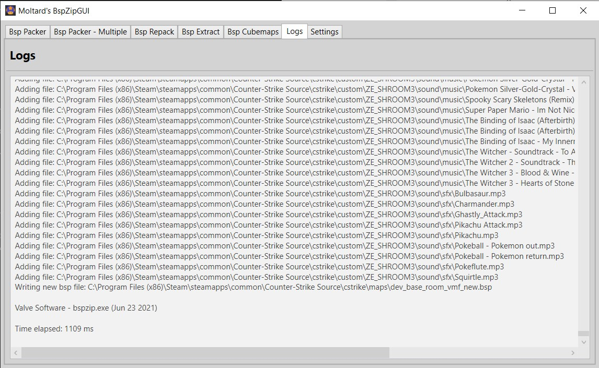
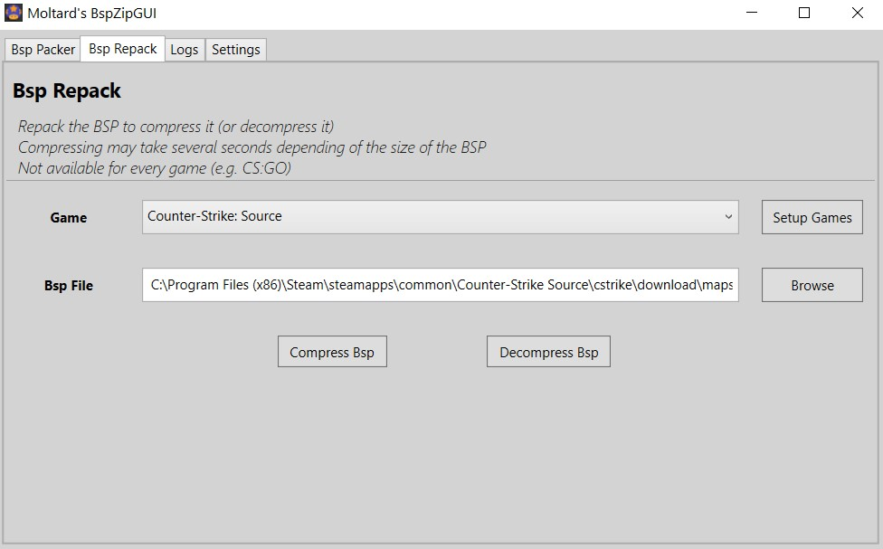

# BspZipGUI
A clean GUI tool that use Valve's BSPZIP command line utility. It is used to embed a folder with custom files (materials, models, sound,..) into a BSP file.

You can also repack a map to compress (or decompress it).

It can be used for any Source Engine game that provide a bspzip.exe.

This tool idea is based on [Geotavros's BspZipGui](https://github.com/geotavros/BspZipGui) .

**2026 update: The tool is <u>fully compatible</u> with BSPZIP++ by ficool2.** 
Download BSPZIP++ here : [HammerPlusPlus Tools](https://ficool2.github.io/HammerPlusPlus-Website/tools.html)

## Download

[BspZipGUI v4.0](https://github.com/Moltard/BspZipGUI/releases/latest)

## How to use - Bsp Packer

Select a game you defined (3 are setup per default), a custom folder you defined and load a BSP.

Check 'Use Directory Whitelist' (recommended) to only pack files from whitelisted directories (see Settings).

Press Pack Bsp.

## How to use - Bsp Multi Packer

Select a game you defined (3 are setup per default), a 'multi custom' folder you defined and load a BSP.

**A multi custom folder contains one or more custom folder. The content of all those folders will be packed into the map**

Check 'Use Directory Whitelist' (recommended) to only pack files from whitelisted directories (see Settings).

Press Pack Bsp.

## How to use - Bsp Repack

Select a game you defined (3 are setup per default) and load a BSP.

Press Compress Bsp or Decompress Bsp.

## How to use - Bsp Extract

Select a game you defined (3 are setup per default) and load a BSP.

Either select a directory (drag drop possible) and click Extract to Directory, or click Extract to Zip.

All packed files will be extracted to the directory/zip file.

## How to use - Bsp Cubemaps

Select a game you defined (3 are setup per default) and load a BSP.

Either select a directory (drag drop possible) and click Extract cubemaps, or click Delete cubemaps.

<u>/!\\</u> Deleting cubemaps actually delete every VTF files packed. That is how bspzip work.

## How to setup

### Games

Add new 'games' configs with the 'Add...' button. Delete them with the 'Delete' button.

Setup your games by loading the gameinfo.txt and bspzip.exe.

---

### Custom Folders

Add new 'custom folders' configs with the 'Add...' button. Delete them with the 'Delete' button.

Load the folder with the custom files that you want to embed in your map.

---

### Multi Custom Folders

Add new 'multi custom folders' configs with the 'Add...' button. Delete them with the 'Delete' button.

Add the folders with the custom files that you want to embed in your map, with the "Add Directory" button.

Remove a folder from the list with Remove Selected.

Drag and dropping is supported.

---

### Directories Whitelist

Define a whitelist of subfolders and type of files (through their extensions) that can be packed. 

(All the subfolders you would need are already setup, but you can edit to your needs)

### Extra setting

To not bloat the UI, multiples settings can only be changed by modifying **settings.xml**.

#### Asynchronous / Synchronous log output

When bspzip.exe is getting executed, you can either get the output of the process as it is getting executed (Async) or get all of it at once after it has finished (Sync).

It doesn't really affect the execution, but you can change it if you want by editing the following line:

- `<IsSyncLogs>False</IsSyncLogs>`

Meaning of the values :
- **False** means that logs are Asynchronously displayed, which is the default behavior
- **True** means that logs are Synchronously displayed
- Not having the line (if you had old settings), will use Asynchronous mode and next time settings are saved, the value will be at **False**.

#### BspZipPlusPlus related settings

With the **release of BSPZIP++ at the start of 2026**, it turned out this tool was not compatible directly with it. 
Due to the usage of a relative path for the `filesList.txt` file used to list all the files to pack, it couldn't execute properly bspzipplusplus.exe, as an absolute path was required. 
This issue is now fixed in the latest release.

BSPZIP++ also added new features, which werent in the default BSPZIP by Valve, so this tool programmed to be able to use them :
- `-verbose` parameter
- `-threads N` parameter for the Repack mode

I added extra parameters in the **settings.xml** file, which can only be edited directly in it (not with the tool).
Those new parameters will let you use the new features of BSPZIP++

The parameters are the following :

- `<UseBspZipPlusPlusArguments>False</UseBspZipPlusPlusArguments>`
- `<UseVerboseForPack>False</UseVerboseForPack>`
- `<UseVerboseForRepack>False</UseVerboseForRepack>`
- `<UseVerboseForExract>False</UseVerboseForExract>`
- `<UseVerboseForCubemaps>False</UseVerboseForCubemaps>`
- `<ExtraParametersPack></ExtraParametersPack>`
- `<ExtraParametersRepack>-threads 1</ExtraParametersRepack>`
- `<ExtraParametersExtract></ExtraParametersExtract>`
- `<ExtraParametersCubemaps></ExtraParametersCubemaps>`

The setting `UseBspZipPlusPlusArguments` when equals to `True` will make the execution of BSPZIP/BSPZIP++ also use the others parameters associated to the current mode. 
**If you are not using BSPZIP++, make sure to keep it at `False`**, because the **default bspzip.exe** will not like any extra unknown parameter and it will not execute correctly.

- If the mode is **PACK** :
    - If the setting `UseVerboseForPack` is equals to `True`, then the `-verbose` parameter will be added at the start of the command
    - The value of the setting `ExtraParametersPack` will be appended at the end of the command as an extra parameter
        - If the setting is empty, then just an empty string will be appended, which doesn't affect anything
- If the mode is **REPACK** :
    - If the setting `UseVerboseForPack` is equals to `True`, then the `-verbose` parameter will be added at the start of the command
    - The value of the setting `ExtraParametersPack` will be appended at the end of the command as an extra parameter
        - If the setting is empty, then just an empty string will be appended, which doesn't affect anything
        - This is the setting where you would add `-threads N`, for example `-threads 2`
- If the mode is **EXTRACT** :
    - If the setting `UseVerboseForPack` is equals to `True`, then the `-verbose` parameter will be added at the start of the command
    - The value of the setting `ExtraParametersPack` will be appended at the end of the command as an extra parameter
        - If the setting is empty, then just an empty string will be appended, which doesn't affect anything
- If the mode is **CUBEMAPS** :
    - If the setting `UseVerboseForPack` is equals to `True`, then the `-verbose` parameter will be added at the start of the command
    - The value of the setting `ExtraParametersPack` will be appended at the end of the command as an extra parameter
        - If the setting is empty, then just an empty string will be appended, which doesn't affect anything

**Do note that the extra parameters are only important for the REPACK mode** since it's the only one that really has a new parameter (`-threads N`). 
But I added the settings for all modes because why not. 
That will make this tool still compatible with any future new parameters that could get added to BSPZIP++

### MAX_PATH size limit

Windows has a hardcoded limitation for file paths, which affect bspzip.exe.

- [Microsoft Doc](https://learn.microsoft.com/en-us/windows/win32/fileio/maximum-file-path-limitation)

If a file path is 260 or more characters, and is packed by bspzip.exe, it will cause issues with packing the rest of the files.
Because it's not something fixable with this software, I instead added a warning if such case happens.

The solution is simple and just requires you to have your custom folder in a shorter path.

### Developers

- [Moltard](https://github.com/Moltard)

